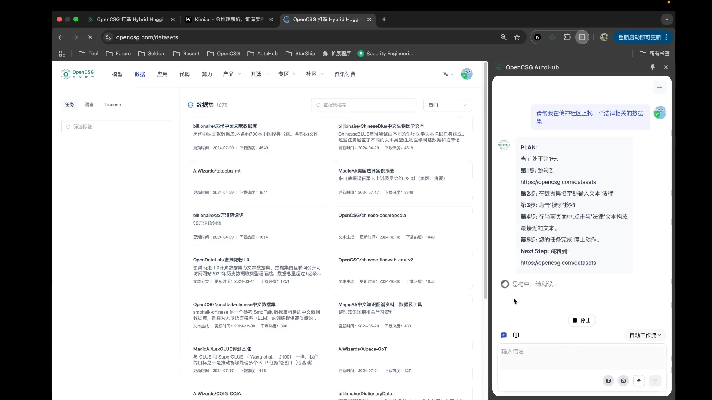

# AutoHub: A Personal Browser Automation Assistant

  

AutoHub is a personal browser automation assistant. Say goodbye to tedious web operations and welcome the use of AutoHub! Through intelligent conversation and automation technology, AutoHub provides you with a more efficient and smarter web browsing experience.

___

# User Guide:

**AutoHub** is a browser automation plugin designed to simplify users' web operations through intelligent conversation and automation technology. It is based on the latest advancements in large model technology and developed by OpenCSG. Whether it's automatically filling out forms, performing multi-page operations, or executing repetitive tasks, AutoHub provides efficient solutions to help users save time and effort. With an intuitive interface and powerful features, AutoHub makes browser operations easier and smarter, optimizing your web experience.

## Video Demonstration

<video src="https://github.com/user-attachments/assets/20529d94-cea3-48ae-8a38-0780f418c393" controls>
  
  Your browser does not support the video tag.
</video>

## Getting Started

AutoHub offers various methods to assist you. Let's start with the following methods:

### **Installation**

- **Chrome Web Store**: You can install AutoHub directly from the Chrome Web Store. Visit [Chrome Web Store](https://chromewebstore.google.com/detail/opencsg-autohub/nlolpocboolodbjkcakhdnnlhmlgpjgl?hl=zh-CN&utm_source=ext_sidebar) to install the plugin. 

### **Local Package Installation (For Chrome and Edge)**

If you prefer to install the local package or encounter issues with the Chrome Web Store, follow these steps:

1. **Download the Plugin Package**
   - Visit the [AutoHub GitHub repository releases]([https://github.com/OpenCSGs/AutoHub](https://github.com/OpenCSGs/AutoHub/releases)) and navigate to the releases section.
   - Download the latest release package (usually a `autohub-*.zip
` file).

2. **Open Chrome Extensions Page**
   - Open Google Chrome.
   - Go to `chrome://extensions/` by typing this URL into the address bar and pressing Enter.

3. **Enable Developer Mode**
   - Toggle the "Developer mode" switch in the top-right corner of the extensions page.

4. **Load the Extension**
   - There are two methods to load the extension:
     - **Method 1: Load Unpacked**
       - Extract the downloaded `.zip` file to a local directory on your computer.
       - Click on the "Load unpacked" button.
       - Navigate to the directory where you extracted the AutoHub package and select it.
     - **Method 2: Drag and Drop the Zip File**
       - Directly drag and drop the downloaded `.zip` file onto the extensions page.

### **Issue & FAQ**

- **Github Issues**: If you encounter any issues or have questions, you can post them on the [AutoHub GitHub Issues page](https://github.com/OpenCSGs/AutoHub/issues). This is a great place to get help from the community and the development team.

By following these steps, you should be able to install and start using AutoHub to enhance your web browsing experience. If you have any further questions or need additional assistance, feel free to reach out through the provided channels.
